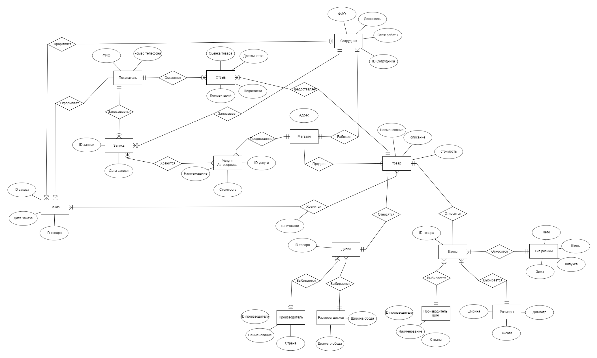
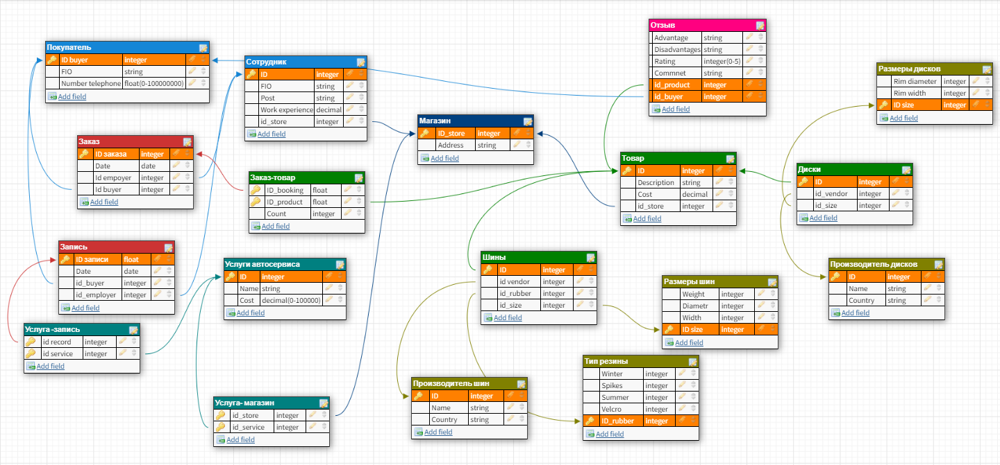
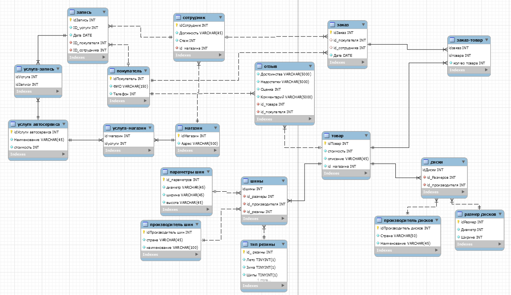

# Ivanova Valeria repository DB

# LAB_1 
Концептуальное проектирование базы данных

# LAB_2
Логическое проектирование базы данных

# LAB_3
[Физическое проектирование базы данных](https://github.com/ValeriaIvanova/Service_/tree/master/lab%203)

# LAB_4
[Реализация SQL-запросов базы данных](https://github.com/ValeriaIvanova/Service_/blob/master/LAB4.sql)
# LAB_5
[Индексы, хранимые процедуры, представления](https://github.com/ValeriaIvanova/Service_/blob/master/lab5.sql)

# LAB_6_7
Взаимодействие с БД из приложения
# Coursework
